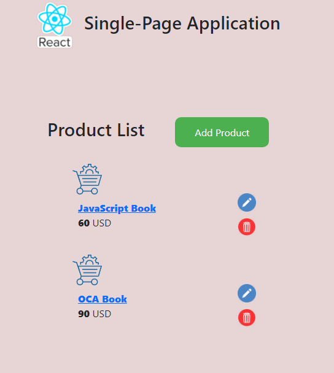
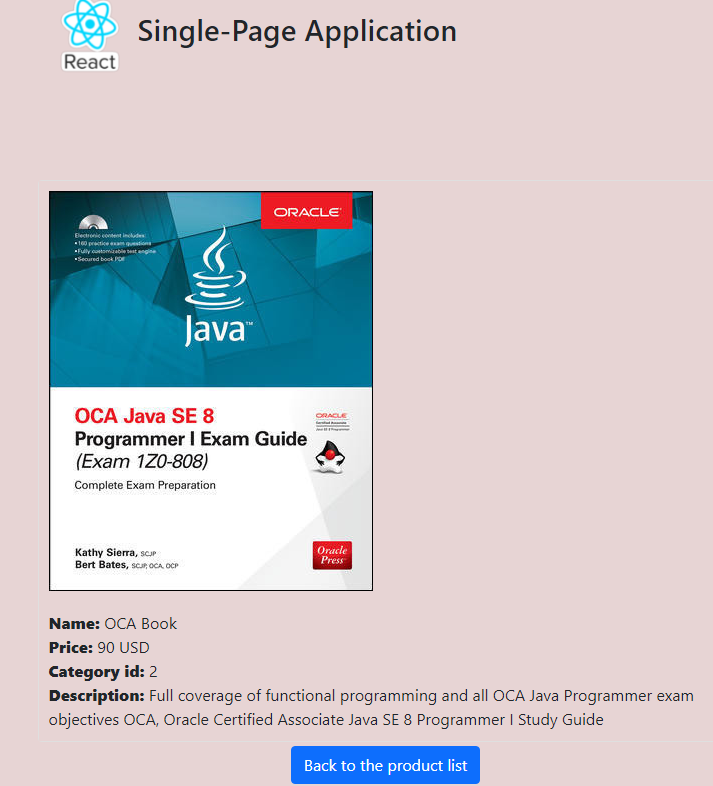
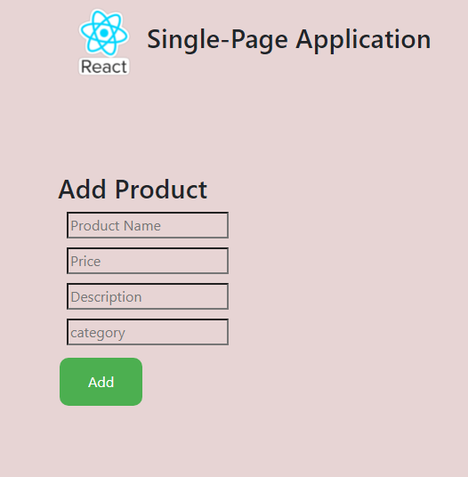

# React Single-Page Application


### CRUD application  

- Install axios, json server, uuidv4, router dom and bootstrap
```
    npm i --save axios
    npm i --save json-server
    npm i --save uuidv4
    npm i react-router-dom --save
    npm install --save bootstrap
```
- create server-api folder:


    cd server-api

- create package.json:


    npm init --yes

- add following to the scripts in the package.json


    "scripts": {
    "start": "json-server -p 3006 -w db.json"
    }

- create database file db.json


    {
        "contacts": [
            {
              "id": "3deec926-fc17-4f32-aca6-6c6b12935038",
              "name": "OCA Book",
              "price": "300",
              "productDetails": {
                "id": 1,
                "description": "Java book",
                "imageUrl": "oca.jpg"
              },
              "category": {
                "id": 1
              }
            }
        ]
    }

- start json server


    server-api>npm start

### Application



